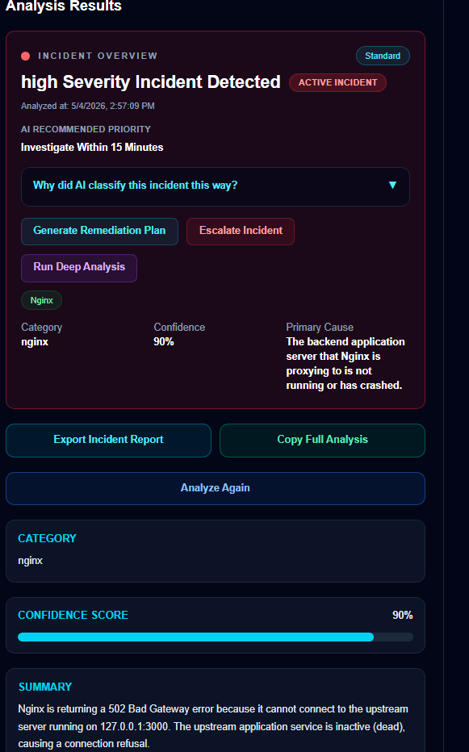
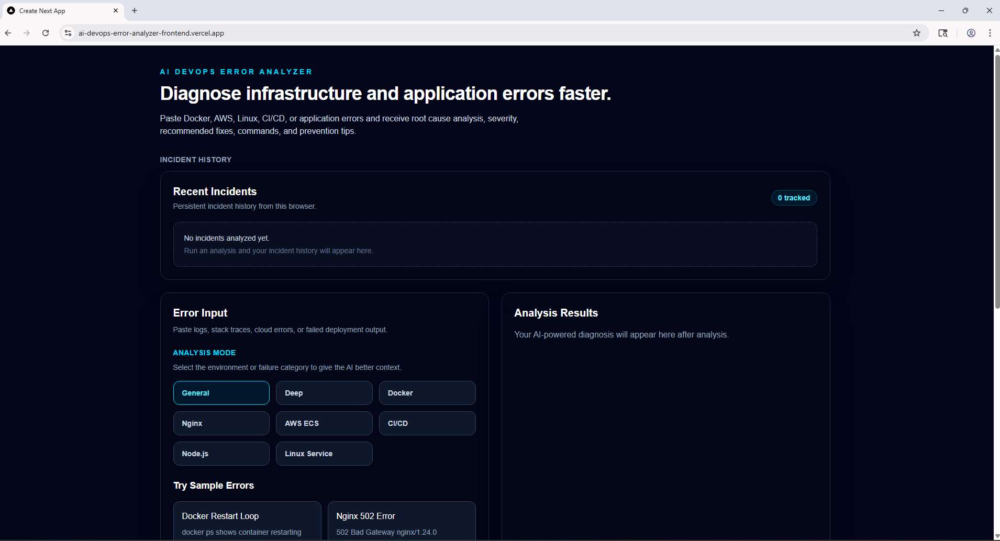
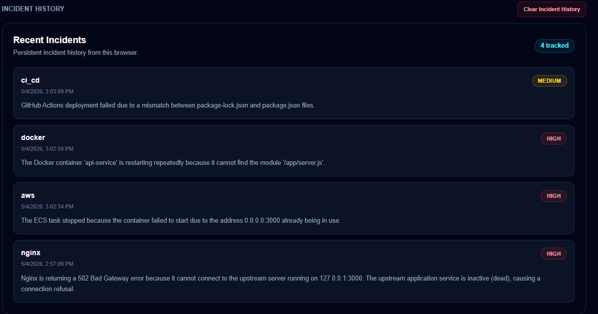
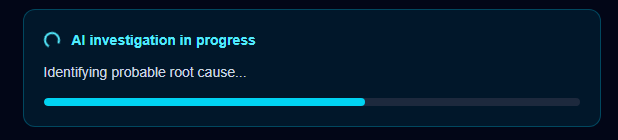

# AI DevOps Error Analyzer

AI-powered DevOps troubleshooting platform that analyzes logs, infrastructure failures, and deployment errors to identify root causes, severity, and remediation steps in seconds.

Built to help engineers reduce debugging time and quickly resolve production issues.

---

## Live Demo

## Preview

See how the AI analyzes real-world DevOps failures in seconds:

### Incident Analysis (High Severity)


### Dashboard


### Incident History


### AI Investigation


* **Frontend:** https://ai-devops-error-analyzer-frontend.vercel.app/
* **Backend API:** https://ai-devops-error-analyzer.onrender.com

---

## Overview

## Why This Tool Exists

DevOps engineers often spend significant time manually analyzing logs and tracing infrastructure issues across multiple systems.

This tool provides a fast, AI-assisted first pass to:

- Surface the most likely root cause
- Highlight severity and impact
- Suggest actionable remediation steps

It is designed to **accelerate troubleshooting**, not replace engineering judgment.

Instead of manually digging through logs, users can paste error output and receive:

* Root cause analysis
* Severity classification
* Step-by-step remediation
* Troubleshooting commands
* Prevention recommendations

---

## Features

* AI-powered error analysis (OpenAI)
* Deep Analysis mode for advanced diagnostics
* Real-time loading + investigation UX
* Persistent incident history (localStorage)
* Severity badges (High / Medium / Low)
* Exportable incident reports
* Copy full analysis output
* Multi-environment analysis modes
* Clean operational dashboard UI

---

## Architecture

```txt
Frontend (Next.js on Vercel)
        ↓
Backend API (Node.js + Express on Render)
        ↓
OpenAI API (AI Analysis Engine)
```

---

## Tech Stack

### Frontend

* Next.js (App Router)
* React
* Tailwind CSS

### Backend

* Node.js
* Express.js
* OpenAI API
* express-rate-limit

### Deployment

* Frontend: Vercel
* Backend: Render

---

## How It Works

1. Paste error logs or upload a `.log` / `.txt` file
2. Select analysis mode (General, Deep, Docker, AWS, etc.)
3. Run analysis
4. AI returns structured results:

   * Root cause
   * Severity
   * Fix steps
   * Commands
5. Save or export results

---

## Environment Variables

### Frontend (Vercel)

```env
NEXT_PUBLIC_API_URL=https://ai-devops-error-analyzer.onrender.com
```

---

### Backend (Render)

```env
OPENAI_API_KEY=your_openai_api_key
API_KEY=devops-ai-secret-key
```

---

## Production Deployment

The application is deployed as a full-stack cloud system:

* Frontend hosted on Vercel
* Backend hosted on Render
* AI powered by OpenAI

### Validation

The following flows were tested in production:

* Analyze error flow
* Deep analysis workflow
* Analyze Again reset behavior
* Incident history persistence
* Export + copy features
* Backend API connectivity
* Responsive UI behavior

---

## Example Use Cases

* Debugging Docker restart loops
* Investigating Nginx 502 errors
* Diagnosing AWS ECS container failures
* Fixing CI/CD pipeline issues
* Troubleshooting Node.js runtime errors

---

## Notes

* Render free tier may introduce cold start delays
* No database is currently used (localStorage for history)
* Designed for rapid first-pass DevOps troubleshooting in real-world production environments

---

## Future Improvements

* Authentication system
* Persistent database storage
* Team collaboration features
* CLI tool for engineers
* API gateway + enhanced security
* Real-time monitoring integrations

---

## Author


**Demarko Little**  
DevOps Engineer | Full-Stack Developer | Cloud & AI Builder

- AWS Solutions Architect Certified
- Experienced in building and deploying scalable cloud applications
- Specializes in CI/CD pipelines, Docker, and production infrastructure
- Focused on AI-powered tools for real-world engineering workflows

---

## License

MIT
